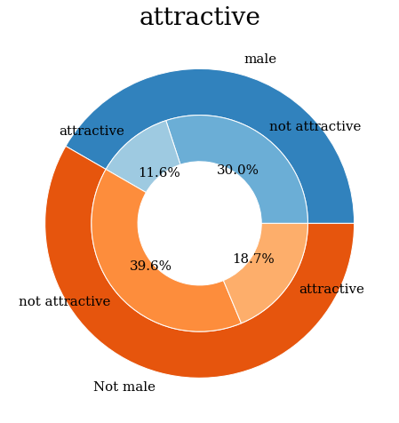
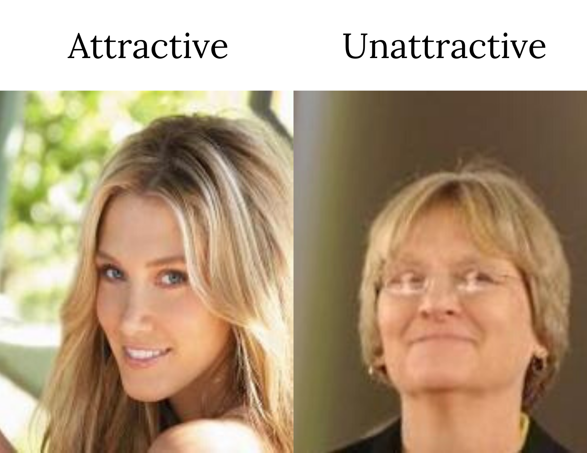
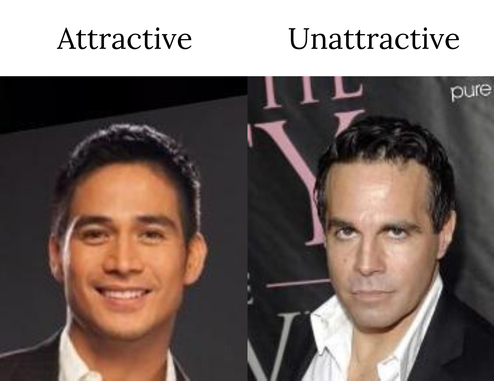
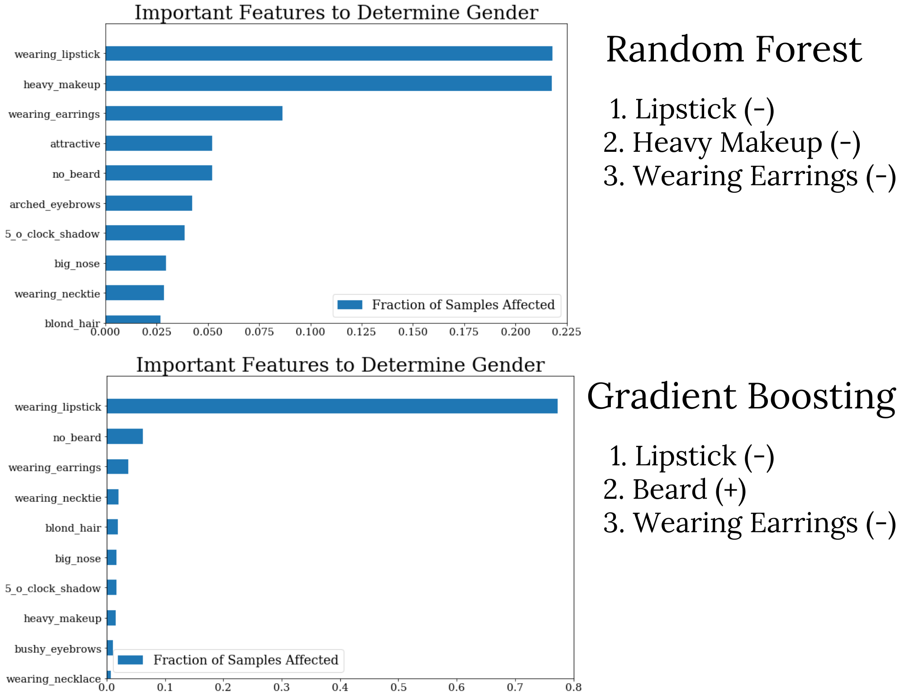
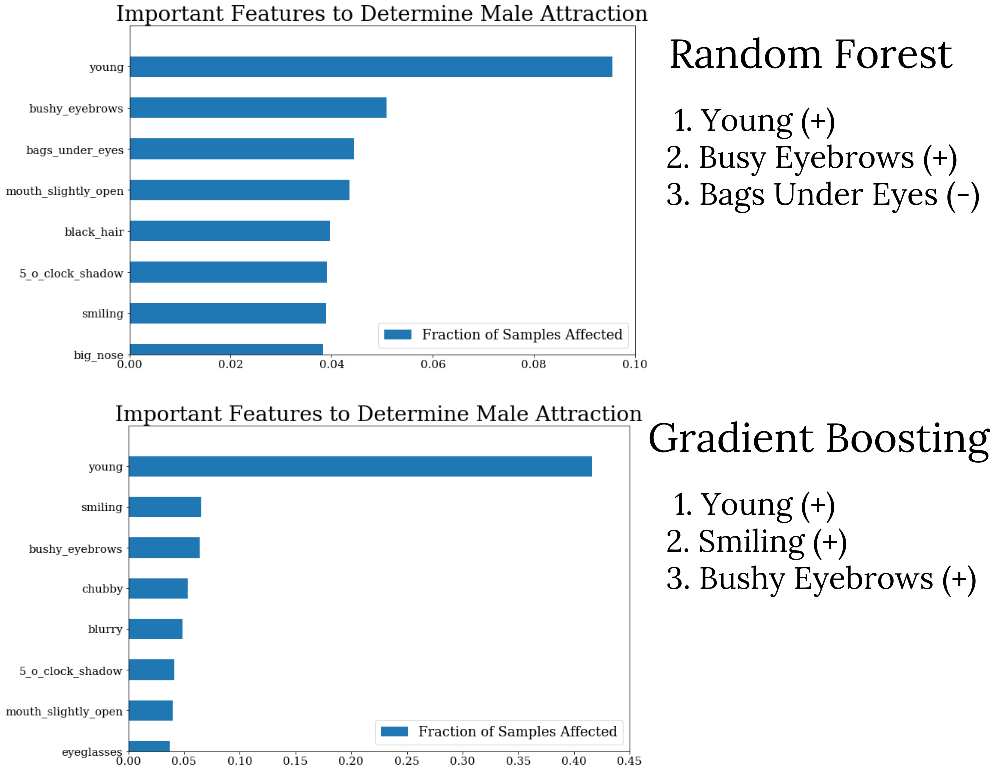
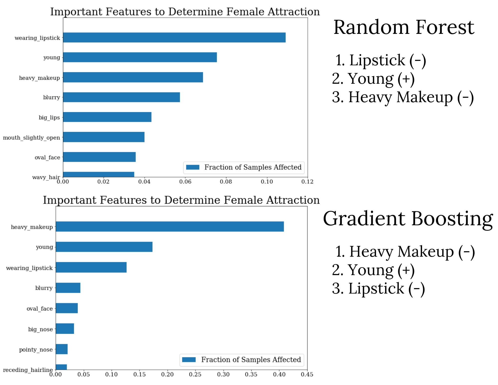

<!--  -->

# Facial_Feature_Predictor
**Using headshots to predict gender and attractiveness**
 Aaron Lee
 
[Linkedin](http://www.linkedin.com/in/aaronhjlee)  |  [Github](https://github.com/aaronhjlee)   |   aaronhjlee1@gmail.com

## Table of Contents

* [Motivation](#motivation)
  * [Personal](#personal)
  * [Question](#question)
* [Strategy](#strategy)
* [Exploratory Data Analysis](#exploratory-data-analysis)
* [Machine Learning](#machine-learning)
* [Deep Learning](#deep-learning)
* [Conclusion](#conclusion)
* [Future Analysis](#future-analysis)
* [Tools Used](#tools-used)
* [References](#references)
* [Contact](#contact-information)

## Motivation

Photography has been a hobby of mine for the past 7 years and inparticular, portrait photography. There are a lot of aspects to consider when taking a good picture. When I was starting out, one of my first paid gigs was to do headshots of lawyers. I would tell them to angle their shoulders one way, tilt their chin another, rest their eyes before the moment, etc. I know for a fact, my first time was not my best work, and very far from it. Like how I would not blame my camera for taking a bad photo, I would never blame my subject for making the photo turn out 'undesireable'. I knew there was a way to make **anyone** look good in front of the camera, it was all about perspective. 

### Personal

So why did I choose to analyze headshots from a dataset of celebrities? It was an easy way to collect data and to start building a model on people, who by in large, deemed attractive. By having a computer take inventory on the myriad of features that come with an individual's face, there would be an unbiased metric of parsing which facial features mattered in determining an individual's picture was attractive or not.

### Question

What facial features determine an attractive headshot?

## Strategy

#### 1. Load and Clean Data
* Resize
* Normalize
#### 2. Exploratory Data Analysis
#### 3. Machine Learning Models
* Random Forest
* Gradient Boosting
* Feature Importance
#### 4. Convolutional Neural Network
* Determine male / female
* Predict probability of attractiveness based on facial features
#### 5. Feature Importance 
* Extract the filters to determine which features are important

## Exploratory Data Analysis

### Data Overview
  1. Dataset: 200000+ faces with 40 attributes and 10000 being unique from [The Chinese University of Hong Kong](http://mmlab.ie.cuhk.edu.hk/projects/CelebA.html)
  2. Some attributes include: male, attractive, oval face, big nose, 5 o'clock shadow, big lips, rosy cheeks, heavy makeup, etc. 
  3. ~60% female and ~40% male  |  ~48% attractive and 62% not attractive
    * MAlES: ~27% attractive
    * FEMALES ~32% attractive
   
  4. Example headshots
     

## Machine Learning

Before we move forward, what is [machine learning](https://en.wikipedia.org/wiki/Machine_learning)? Machine learning is the act of having the computer learn something without being explicitly programmed to do so. This is the act of feeding the computer [labeled data](https://en.wikipedia.org/wiki/Labeled_data) so that it can learn the differences between data point to data point. 

In our case, we will be using 2 forms of supervised learning called: [Random Forest Classifier](https://scikit-learn.org/stable/modules/generated/sklearn.ensemble.RandomForestClassifier.html) and [Gradient Boosting](https://en.wikipedia.org/wiki/Gradient_boosting). From these models, we can hopefully start to get an idea of which features are important to determining both gender and attraction. In both models, we will be giving them the attributes from the metadata of each picture.

If you are not wearing lipstick, heavy makeup, and earrings, there's a high chance of you being a male. This is supported by having a beard.

Being young, having bushy eyebrows, smiling, and no bags under your eyes consitutes an attractive male.

By having no lipstick, no heavy makeup, and looking young, you are more likely to be classified as attractive by western standards.

Although these results are logical and may seem definitive, when we submit a picture, we are not able to readily extract these 40 attributes. Therefore this is merely used as a rough benchmark to determine gender and attractiveness. This leads us to turn to more sophisticated models of processing data, ie. deep learning.

## Deep Learning

Below is a detailed look into the architecture employed in the popular [VGG16](https://neurohive.io/en/popular-networks/vgg16/) image classification and detection model. 

## Conclusion

## Future Analysis

## Tools Used

* [Python](https://www.python.org/)
* [Pandas](https://pandas.pydata.org/)
* [Numpy](http://www.numpy.org/)
* [SciPy](https://www.scipy.org/)
* [Matplotlib](https://matplotlib.org/)
* [Seaborn](https://seaborn.pydata.org/)
* [Scikit-Learn](https://scikit-learn.org/stable/)
* [Tf.Keras](https://www.tensorflow.org/guide/keras)

## References

* http://mmlab.ie.cuhk.edu.hk/projects/CelebA.html
* https://neurohive.io/en/popular-networks/vgg16/

## Contact Information
Aaron Lee is a Data Scientist with a background in education and portrait/landscape photography. His interests other than data science include music, photography, backpacking, basketball, and running. 

* Linkedin: [in/aaronhjlee](https://www.linkedin.com/in/aaronhjlee/)
* Github: [/aaronhjlee](https://github.com/Aaronhjlee)
* Email: [aaronhjlee1@gmail.com](aaronhjlee1@gmail.com)

Copyright © 2019 Aaron Lee